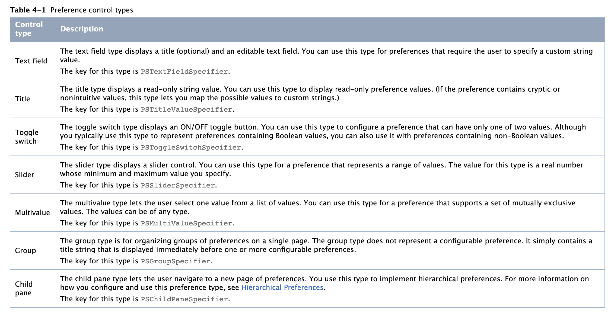

## QLSettingBundleDemo

### 一、解释
在iOS开发中很多时候开发者需要让用户自行设置一些系统的配置项目,在系统设置中展示App版本等信息。

在设备设置中，App权限下面展示自定义内容，如类似下图圈住区域内容：


### 二、官方文档 Settings.bundle配置说明

1. Settings.bundle: [Apple 文档链接](https://developer.apple.com/library/archive/documentation/Cocoa/Conceptual/UserDefaults/Preferences/Preferences.html#//apple_ref/doc/uid/10000059i-CH6-SW4)

2. 在Settings.bundle 中支持如下几种配置项：
> 备注：类型代表着在 `root.plist` 文件中可以选择的数据项，其中`Child Pane` 没有显示，可在type中选择，也可手动输入 `PSChildPaneSpecifier ` 类型。

类型   | 标准             |  中文  | 解释 
----- | ---------------- | ----- | ----
Group | PSGroupSpecifier |  编组  | 类似于tableview的group haeder
Title | PSTitleValueSpecifier | 文本 | title
Toggle Switch | PSToggleSwitchSpecifier | 开关 | 开关
Multi Value | PSMultiValueSpecifier | 多层选择 | 进入下一级选择数据
Text Field | PSTextFieldSpecifier | 输入框 | --
Slider | PSSliderSpecifier |  进度条  | --
Child Pane | PSChildPaneSpecifier | 子plist | 进入下一级选择另外一个plist中数据




### 三、开始设置

#### 1. 在项目中添加Settings.bundle文件

```
New File -> Resource -> Settings Bundle
```

#### 2. 添加要展示的内容

在 `Settings.bundle` 中 `en.iproj` 为多语言时候使用的，暂且不管。

- 在自定义添加的xxx.plist文件中格式为`StringsTable：指向父类plist文件` + `PreferenceSpecifiers: 数据文件，可添加显示内容`

- 我们主要关心的是 `Root.plist` 文件。这个文件决定了我们存储的数据在设置菜单里面显示的方式，它有2个文件，文件1为 `Strings Filename`，文件2为`Preference Items`：在文件2中有以7中类型：

##### - 1. Group : 

```
1. Title -- 标题
```

##### - 2. Title : 

```
1. Title  -- 标题
2. Identifier / Key -- 标志，可以在代码中以此取值
3. Default Value  -- 默认显示文本
```

##### - 3. Toggle Switch : 

```
1. Title  -- 标题
2. Identifier / Key  -- 标志，可以在代码中以此取值
3. Default Value  -- 默认是否选中、YES/NO
```

##### - 4. Multi Value : 

```
1. Title  -- 标题
2. Identifier / Key  -- 标志，可以在代码中以此取值
3. Default Value  -- 默认显示文本
4. Titles -- 标题的集合，与值一一对应
5. Values -- 值的集合
```

##### - 5. Text Field : 

```
1. Title  -- 标题
2. Identifier / Key  -- 标志，可以在代码中以此取值
3. Default Value  -- 默认显示文本
4. isSecure  -- 是否为安全文本 YES/NO
5. AutocapitalizationType  -- 自动大写。有四个值: None(无)、Sentences(句子首字母大写)、Words(单词首字母大写)、All Characters(所有字母大写)。
6. AutocorrectionType  -- 自动纠正拼写，如果开启，你输入一个不存在的单词，系统会划红线提示。有三个值：Default(默认)、No Autocorrection(不自动纠正)、Autocorrection(自动纠正)。
7. KeyboardType  -- 键盘样式。有五个值：Alphabet(字母表，默认)、Numbers and Punctuation(数字和标点符号)、Number Pad(数字面板)、URL(比Alphabet多出了.com等域名后缀)、Email Address(比Alphabet多出了@符合)。
```

##### - 6. Slider : 

```
1. Identifier / Key  -- 标志，可以在代码中以此取值
2. Default Value  -- 数值
3. Minimum Value -- 最小值，Number类型。
4. Maximum Value -- 最大值，Number类型。
5. Min Value Image Filename -- 最小值那一端的图片。
6. Max Value Image Filename -- 最大值那一端的图片。
```

##### - 7. Child Pane : 

```
1. Title  -- 标题
2. Identifier / Key -- 标志，可以在代码中以此取值
3. File  -- 指向子类plist文件名
```

 - 注意：图片大小必须为 `21*21`，并且要放在Settings.bundle包内(在Finder里显示包内容，然后粘贴)。

- 获取用户的设置是通过 `NSUserDefaults` 取设置的 `Identifier/key` 为key的值
`[[NSUserDefaults standardUserDefaults] objectForKey:@"xxxx"];`

### 四、程序中获取配置信息

```
- (void)viewDidLoad {

     [super viewDidLoad];

    // 此处的 “kMPSelectedEnvironment” 是在 “Service.plist”中设置的，请一一对应
    NSUserDefaults *userDefaults = [NSUserDefaults standardUserDefaults];
    NSLog(@"%@",[userDefaults objectForKey:@"kMPSelectedEnvironment"]);

 }
 
```

--

# BY QiuFairy 